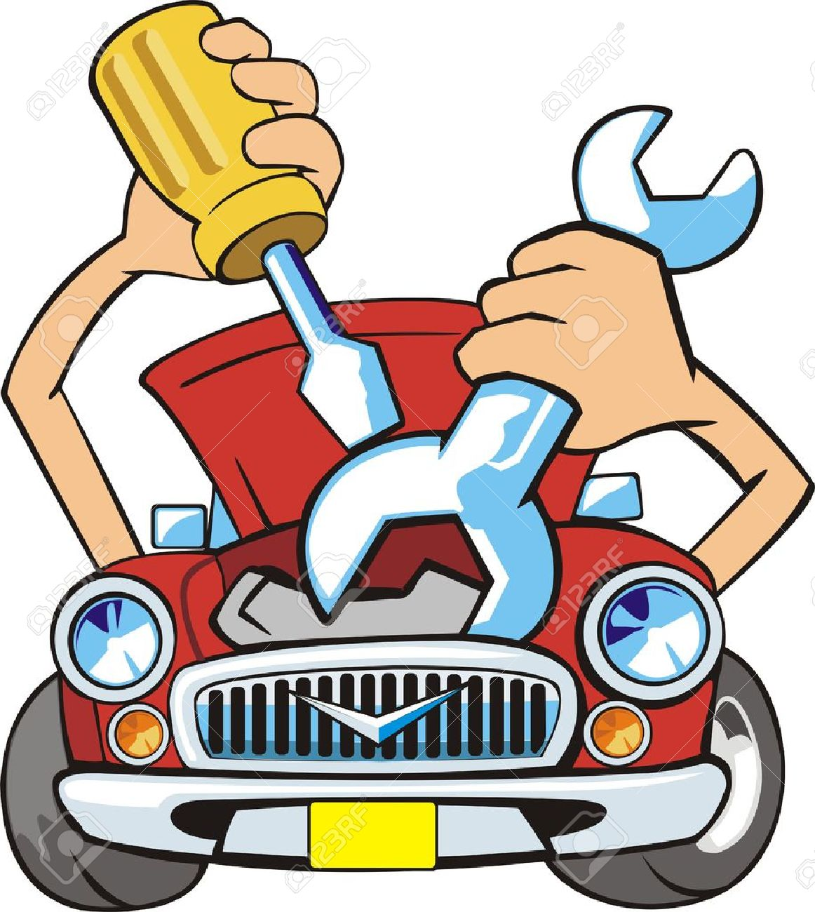

`Steps:
1. Navigate to admin event list
2. Select event to edit
3. Modify event details (title, date, pricing)
4. Save changes
5. Verify updates reflect on public event page
6. Check that existing bookings remain valid
7. Test edit history/audit log

